### 前言
　　Burp Suite 是一款非常优秀的抓包工具之一，渗透测试必备神器，本章不介绍最最最基本的抓包配置等等，只介绍常用功能。
<!-- more -->
### 环境
　　物理机: 192.168.2.213
　　靶　机: 192.168.2.123
　　K a l i  : 192.168.2.161
### Proxy
####  问题描述
　　物理机无法抓靶机流量包，Kali能抓靶机流量包，但告知你必须要用物理机去抓到靶机流量包，怎样办？
#### 问题解决
　　在Proxy->Options->Proxy Listeners->Add 添加代理侦听
　　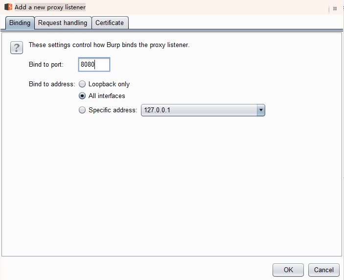
　　设置绑定端口：随便设置 我设置为8080，设置绑定地址：我设置的是全网卡，直接ok选择yes后退出
　　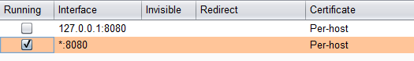
　　不抓本地包，所以去掉第一个选项卡
　　配置靶机中浏览器代理为物理机中的ip，端口为刚才设置的8080
　　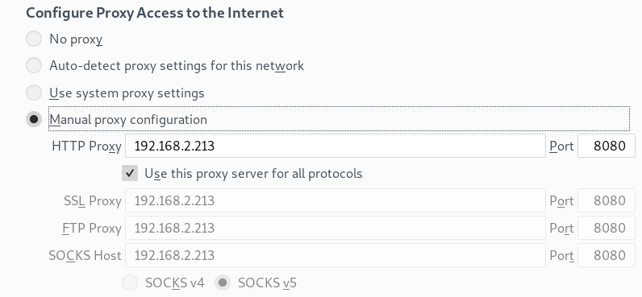
　　抓包成功,当然强大的burp也能抓手机包,本篇不介绍
　　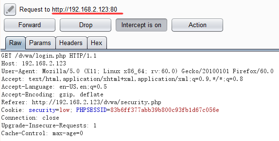
#### options
　　只介绍Response Modification功能
　　设置用于执行自动响应的修改。可以使用这些选项通过自动重写应用程序响应的HTML来完成各种任务。 下列选项在数据删除客户端控件可能是有用的
　　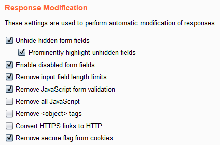
　　有些网页中是把表单隐藏了的
　　Unhide hidden form fields:显示隐藏的表单
　　　　Prominently highlight unhidden fields:高亮显示这些字段
　　有些表单是禁止输入内容的
　　Enable disabled form fields:启用禁用的表单
　　比如你输入密码框长度不能超过多少位，这个就可以突破
　　Remove input field length limits:移除输入字段长度限制
　　比如是否按正确的格式去输入
　　Remove JavaScript from validation:从验证中删除JavaScript
　　这个具体实际作用在哪里我也不知道
　　Remove secure flag from cookies:从cookies中删除安全标志
　　secure flag如图所示
　　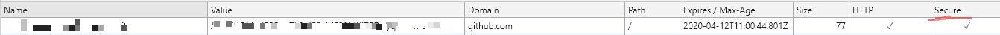
### 导出项目
　　最上面的选项卡Burp->Save copy of projec
　　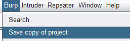
　　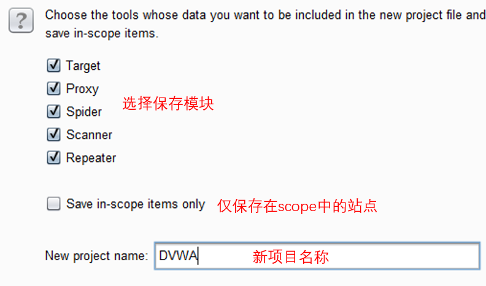
　　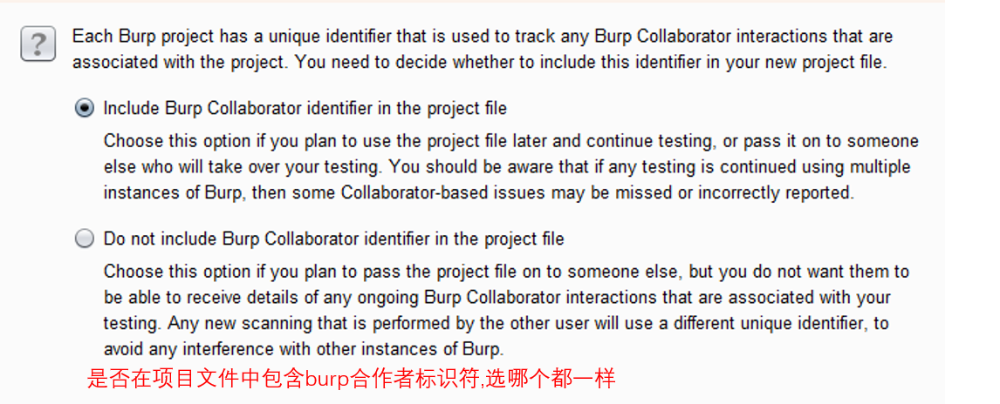
　　再下一步就是选择保存位置和文件名称，点击保存就完成了

### 导入项目
　　写的够详细了，就不介绍了
　　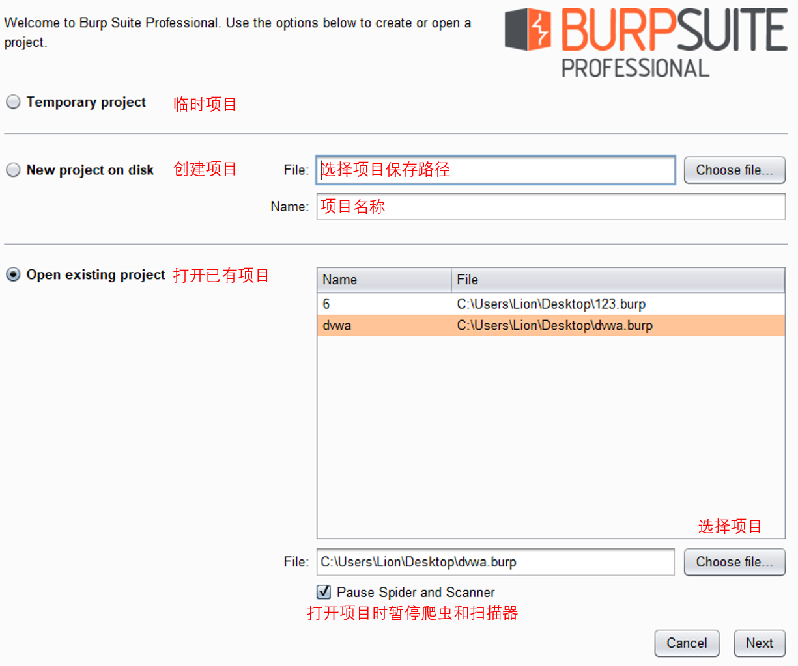

### Target
####  site map
　　当你抓取到了流量包后,会在target模块中生成站点地图,它采用树状的层次结构显示信息。
　　站点又分为两类:黑色和灰色
　　黑色:浏览器真正的对一个url发起了请求,服务器对它返回了响应信息
　　灰色:从页面中的url爬网爬出来的,并没有对该url的资源发生真正的访问一次。
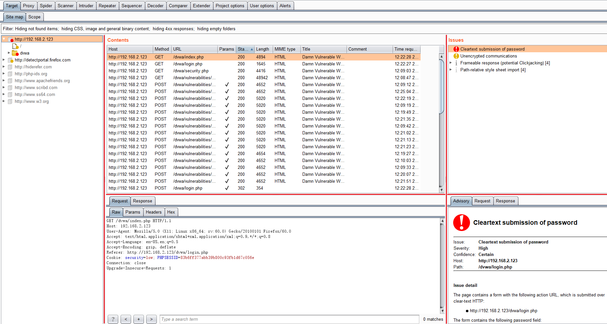

| 内容区域 | 信息描述 |
| :------: | :------: |
|   左边   | 站点层次目录 |
| 中上 | 此站点具体请求流量包历史 |
| 中下 | 此流量包具体数据内容(请求包,响应包) |
| 右上 | 安全提示 |
| 右下 | 安全建议 |

#### scope
　　查看当前站点过滤信息，当你想只查看某一个站点信息或者某个目录的时候，如下图所示选择要显示的站点，发送到scope去。
　　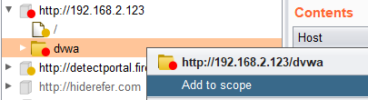
　　Include in scope:只查看当前列表中的站点信息=白名单
　　Exclude from scope:排除掉列表中的站点信息=黑名单
　　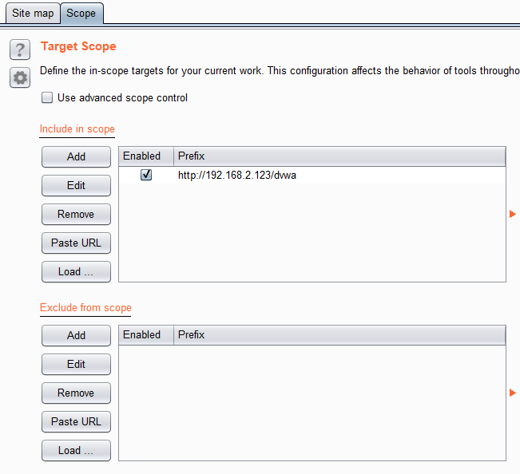

#### site map filter
　　单击filter哪一栏,会弹出过滤器规则,当你勾选好过滤规则后,只需要点击其他空白处,就会自动开始过滤
　　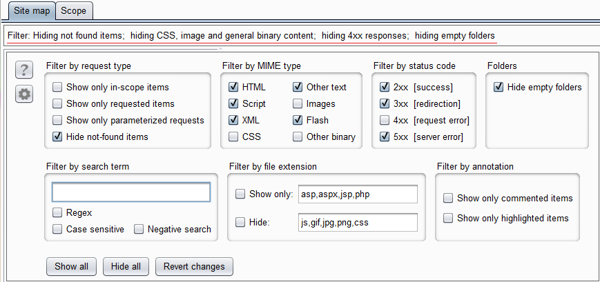
　　Show only in-scope items:仅显示范围内的站点(此处需搭配scope使用) 勾选后入图所示
　　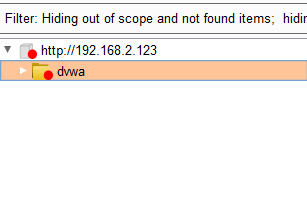
　　Show only requested items:仅显示真正发起请求的站点
　　Show only parameterizend requests:仅显示参数化的请求 也就是 过滤掉html,htm这类站点
　　Filter by search term:按关键词筛选 比如我只看url地址中包含了dvwa关键字
　　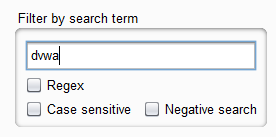
　　结果入图所示
　　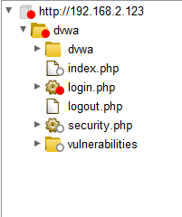
　　Filter by MIME type:按文件类型筛选
　　Filter by status code:按状态码筛选
　　Filter by file extension:按文件扩展名筛选 
　　　　show only:展示asp,aspx,jsp,php等扩展名
　　　　Hide:不展示js,gif,jpg,png,css等扩展名
　　Filter by annotation:
　　　　Show only commented items:仅显示注释的项目
　　　　给url添加注释
　　　　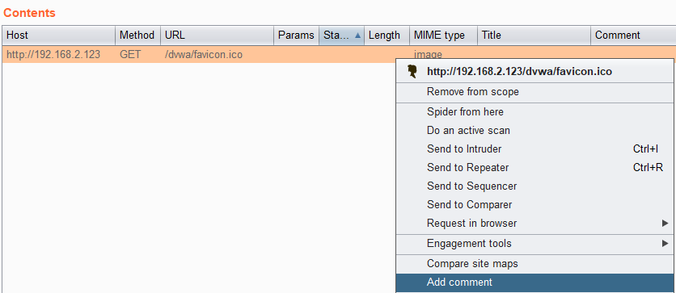
　　　　添加完注释后
　　　　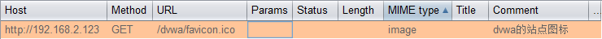
　　　　Show only highlighted items:仅显示高亮的项目
　　　　点击host进行高亮设置
　　　　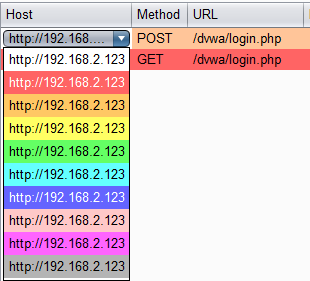
　　当你选乱的情况下,在Filter下面show all;hide all那一栏点击Revert changes:还原更改

### Spider
　　它提供爬虫功能，帮助来爬取网站目录结构
　　右键选择要爬取的主机或者分支发送到spider，它就会自动开始爬取网站
　　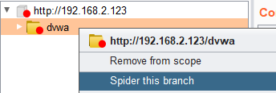
　　如果遇到需要验证的表单，burp会自动弹出，知道就填上，提交选Submit form，忽略选Ignore form
　　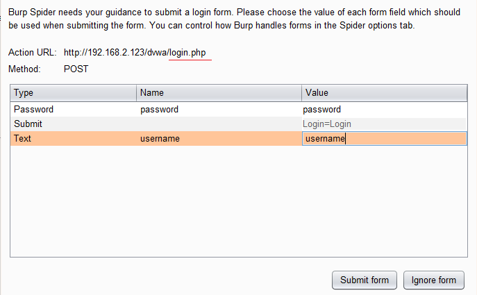
#### control
　　在Spider->Control可以看见爬取的状态
　　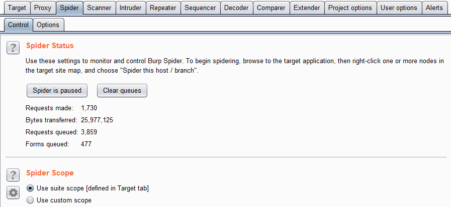
　　Requests made:已经发送的请求
　　Bytes transferred:传输字节
　　Requests queued:请求的队列数量
　　Forms queued:正在排队的表单数量
　　点击Spider is running 后，暂停爬取，再次点击继续爬取
　　Clear queues:清除队列
#### options
　　Spider->Options->Application Login 到申请登陆功能这里查看
　　默认选择Prompt for guidance即需要身份验证的时候就提示
　　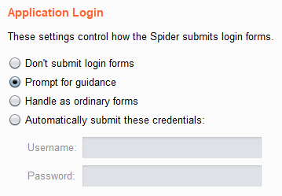
　　Don't submit login forms:不要进行表单提交身份验证
　　Handle as ordinary forms:普通形式处理
　　Automatically submit these credentials:自动提交这些凭据 勾选后 它将自动将username和password里面的数据提交进表单
　　其他功能默认就行
### Scanner
　　在进行scanner(漏洞扫描)前，先使用spider功能，这样可以最大限度发现漏洞
　　右键选择分支或者主机，选择主动扫描，没有搞懂被动扫描有什么用
　　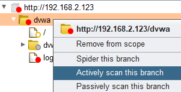
　　这时会弹出主动扫描向导
　　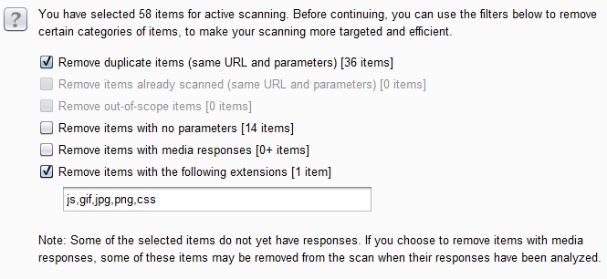
　　最后一个选项Remove items with the follwing extensions:以下扩展名的不扫描。没必要扫这些勾选上
　　直接Next->Ok就开始进行扫描
#### Scan queue
　　此处查看扫描队列的详细进度
　　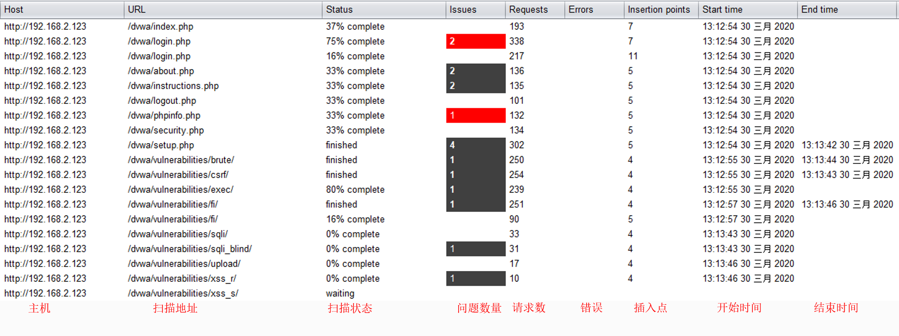
　　Issues颜色级别
　　High:红色	Medium:橙色	Low:黄色	Information:深灰色
#### Issue activity
　　此功能是查看具体安全报告信息
　　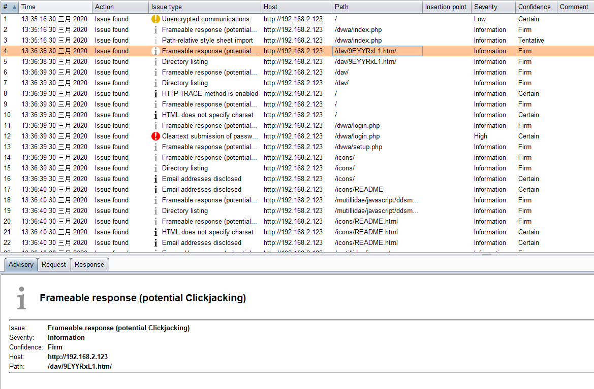
　　上面一部分

| Action | Issue type | Host | Path | Insertion point | Severtity | Confidence |
| :----: | :--------: | :--: | :--: | :-------------: | :-------: | :--------: |
|  行为  |  问题类型  | 主机 | 路径 |     插入点      | 严重程度  |  确信程度  

　　Confidence(信任度由高到低):  Certain>Firm >Tentative
　　下面一部分
　　给出漏洞修补建议,即漏洞细节和漏洞背景,还有一如既往的请求包和响应包

#### options 
##### Attack Insertion Points
　　change parameter locatons:更改参数的位置
　　这些都勾选上，比如url里面的内容放到cookie，逐一检查
　　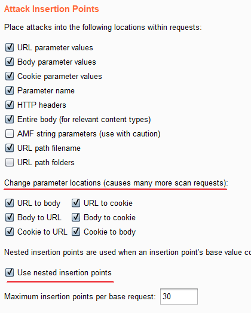
　　第二个划红线的意思是发现隐蔽的命令注入点，如url中的base64编码，解码后发现是xml的值或者json，ajax等客户端对象存储的数据

##### Active Scanning Engine
　　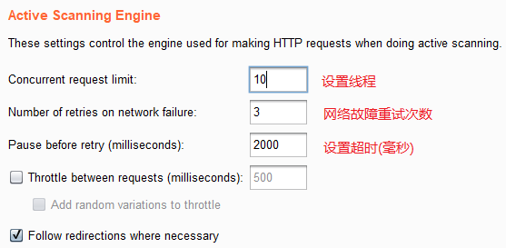
##### Active Scanning Optimization
　　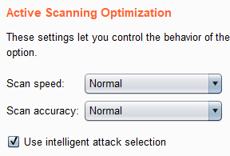
　　Scan speed:扫描速度
　　扫描仔细度:Thorough > Normal > Fast
　　Normal:正常速度	Fast:快	Thorough:彻底扫描
　　Scan accuracy:扫描精度
　　Normal:正常精度	Minimize false negatives:最小漏判(追求扫描最多漏洞数量时选择)	Minimize false positives:最小误报(追求扫描结果准确性时选择)
### Intruder
　　Intruder是一个强大的工具，用于自动对Web应用程序自定义的攻击，Burp Intruder 是高度可配置的，并被用来在广范围内进行自动化攻击。你可以使用 Burp Intruder 方便地执行许多任务，包括枚举标识符，获取有用数据，漏洞模糊测试。合适的攻击类型取决于应用程序的情况，可能包括：缺陷测试：SQL 注入，跨站点脚本，缓冲区溢出，路径遍历；暴力攻击认证系统；枚举；操纵参数；拖出隐藏的内容和功能；会话令牌测序和会话劫持；数据挖掘；并发攻击；应用层的拒绝服务式攻击。
　　在请求包或者响应包都能右键Send to Intruder
　　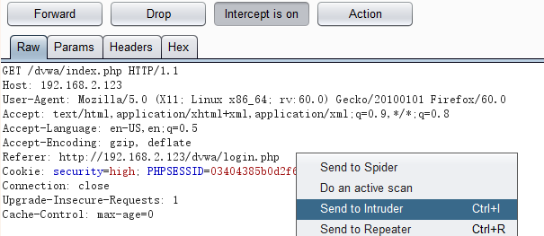

#### positions
　　在positions选项卡下可以看见burp默认标记了一些变量
　　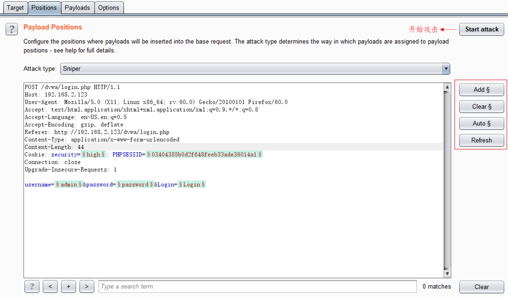
　　先Clear$掉清除变量，这里演示爆破用户名和密码，点击右边的Add$分别将admin和password设置为变量，后面再攻击的时候它将循环替换此处变量内容，从而达到暴力破解
　　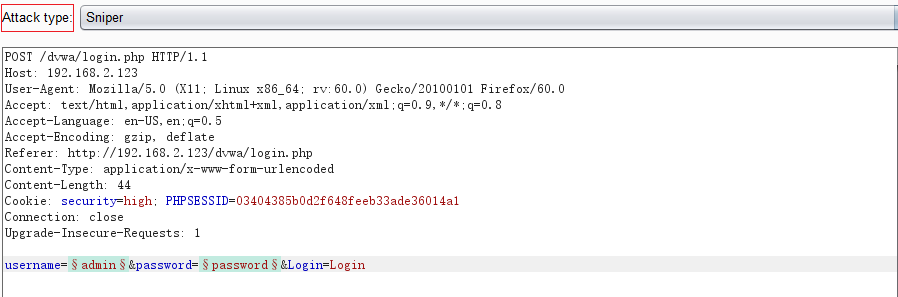
　　这里的攻击类型有四种分别是：Sniper(狙击手)、Battering ram(攻城槌)、Pitchfork(杈子)、Cluster bomb(集束炸弹)，稍后会讲，在攻击前先设置Payloads
　　如果你要爆破后台的话，将url作为变量也未尝不可以，一句话任何内容都可以设置为变量
　　

#### payloads
　　　选择不同的类型下图中的payload设置也会不同，常用的类型Simple list
　　　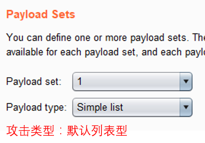
　　　后面的攻击类型的字典我都会用下图
　　　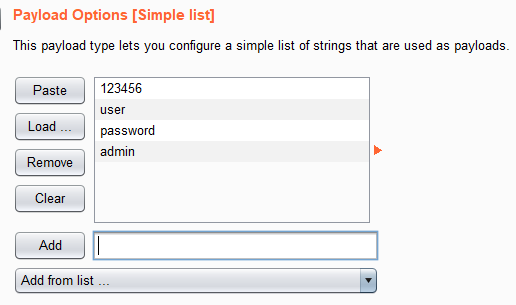
　　　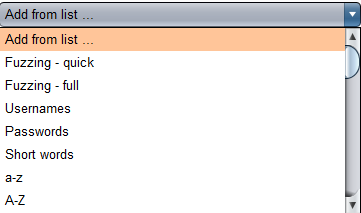
　　　你可以手动添加内容，如上图所示，按回车或者点击Add。或者点击Load从文件中选择一个字典，或者选择burp内置的字典。
　　　也可以对payload加工变形，点击Add添加变形类型
　　　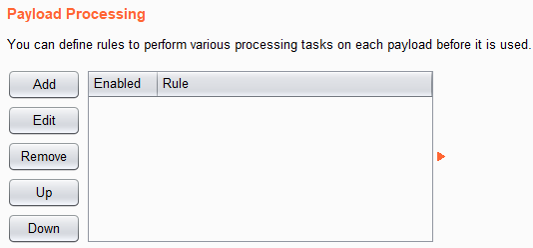
　　　仅介绍几个	设payload 有 name admin 两个
　　　Add prefix:添加前缀 如添加user后　　payload为:username,useradmin
　　　Add suffix:添加后缀 如添加1234后	 　payload为:name1234,admin1234
　　　Match/replace:匹配/替换　如Match regex:m　Replace with:6 后
　　　payload为:na6e,ad6in

------
　　　Payload Options设置好后就可以点击Start Attack
　　　然后介绍几个payload type
　　　<b>Numbers</b>
　　　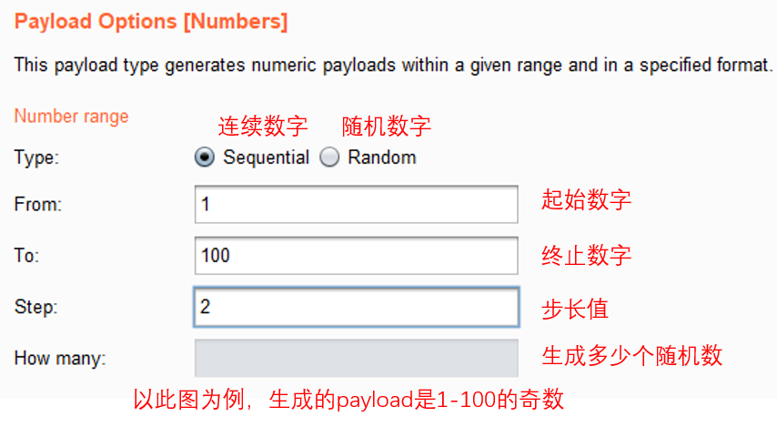
　　　<b>Brute forcer</b>
　　　它是将最小字符到最大字符直接从攻击字符中随便挑选几个字符，比如我这里设置的是4个字符，那么它就会随便挑选4个字符，将所有情况都会尝试，是一种非常暴力的攻击，从图中可以看出有3359232种情况
　　　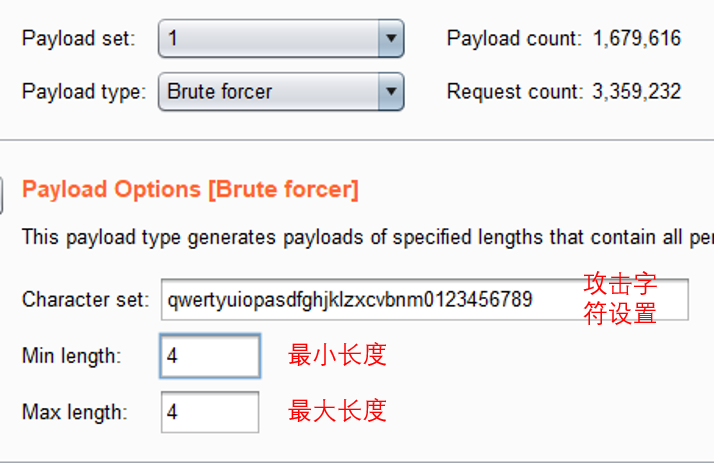

#### Sniper(狙击手)
　　此类型先将列表中的内容，先替换变量１的值，不改变变量２的值。然后尝试完后，再将列表中的内容替换变量２的值，不改变变量１的值。有第三个变量的话，以此类推。
　　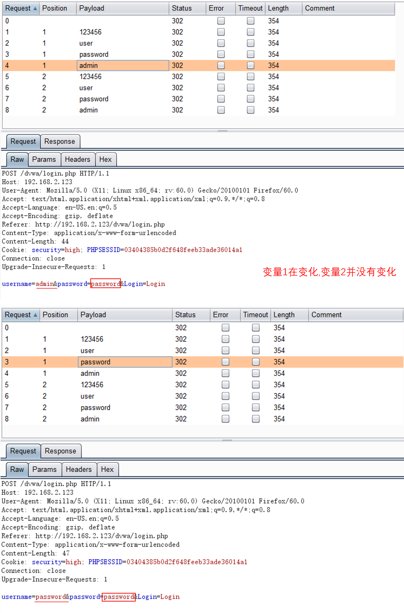

------
　　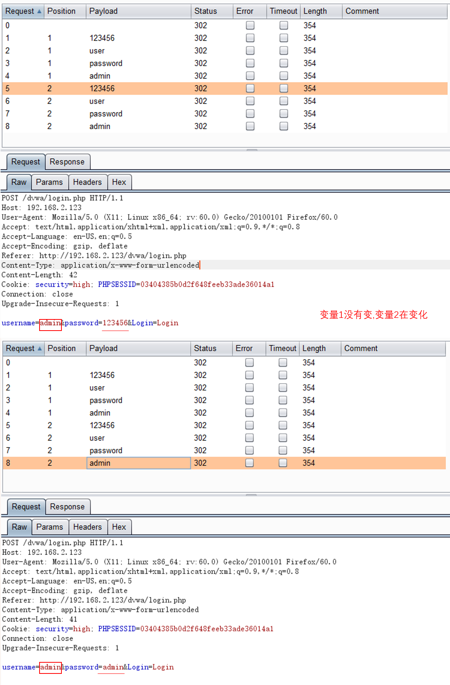
#### Battering ram(攻城槌)
　　此类型是将列表中的内容替换所有变量
　　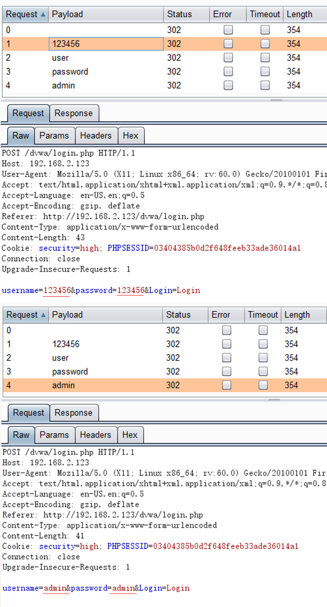
#### Pitchfork(杈子)
　　此类型将会设置两个Payload Sets 两个列表中的内容按顺序成对替换
　　Payload1设置
　　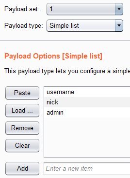

------
　　Payload2设置
　　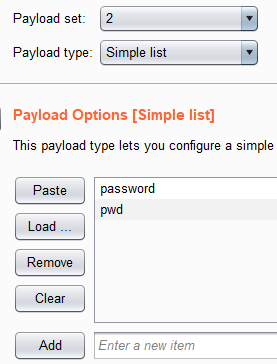
　　可以看出payload1比payload2内容多了一行，前面说过是成对出现，所以你猜开始攻击后会怎么提交payload？
　　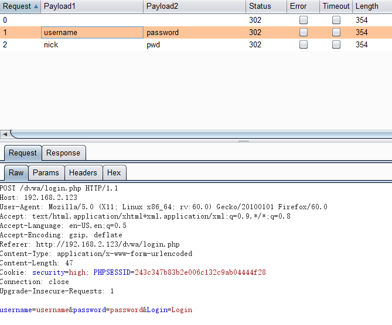
　　所以没有匹配内容后就停止发包了
#### Cluster bomb(集束炸弹)
　　此类型是真的全面，举例payload1 有username，admin。payload2有password，passwd，攻击的payload为username password、username passwd、admin password、admin passwd
　　payload1 和 payload2不变，依然使用上次的设置，开始攻击
　　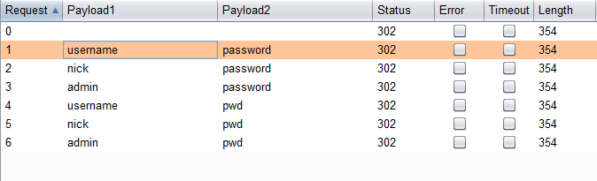
　　此类型和Sniper(狙击手)是经常使用的

#### Filter
　　当请求过于杂而多时，这时候筛选器就登场了，设置好后点击其他任意位置后，开始自动筛选
　　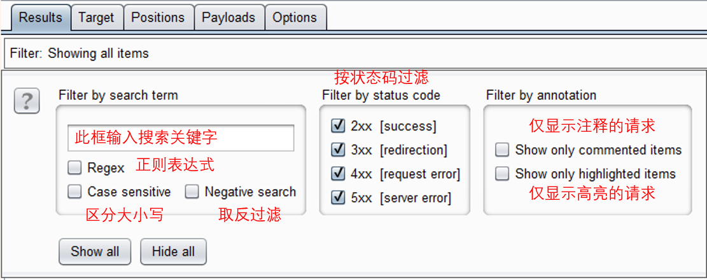

#### 实战演示
##### 列子1
　　此处题目来自于[攻防世界](https://adworld.xctf.org.cn/task/answer?type=web&number=3&grade=0&id=5069&page=1)
　　截断靶机请求包，发送进intruder
　　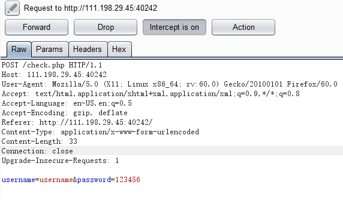
　　选择Cluster bomb攻击类型，设置好变量，配置payload
　　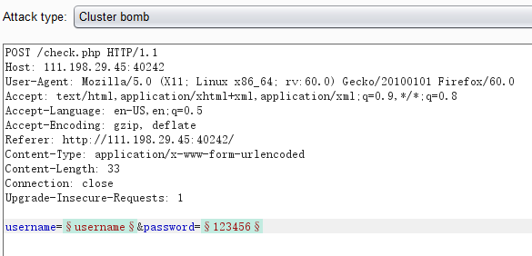
　　这年头谁还没有个字典呢，开始攻击
　　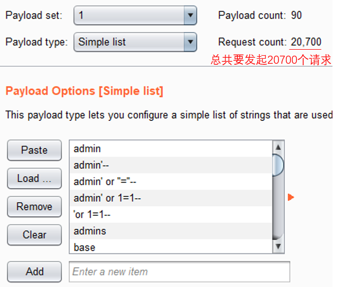
　　经过漫长的等待后终于跑完了
　　知识点补充:通过响应内容的长度可以作为一个特征来发现那个是正确的密码，或者通过响应的状态码，点击length可以进行升序或者降序排列。
　　升序排列后如下图所示，既然用户名正确，哪就慢慢往下找看有没有正确的密码了
　　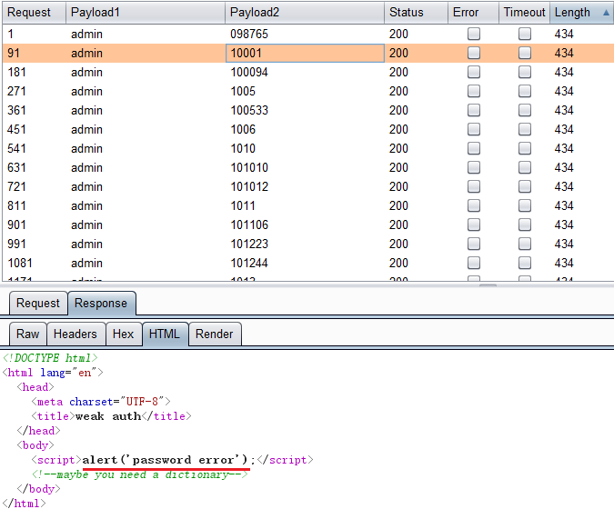
　　仔细看这独一无二的响应码437，其实一般爆破成功后，length一筛选马上就能发现那个秀儿，成功拿到flag
　　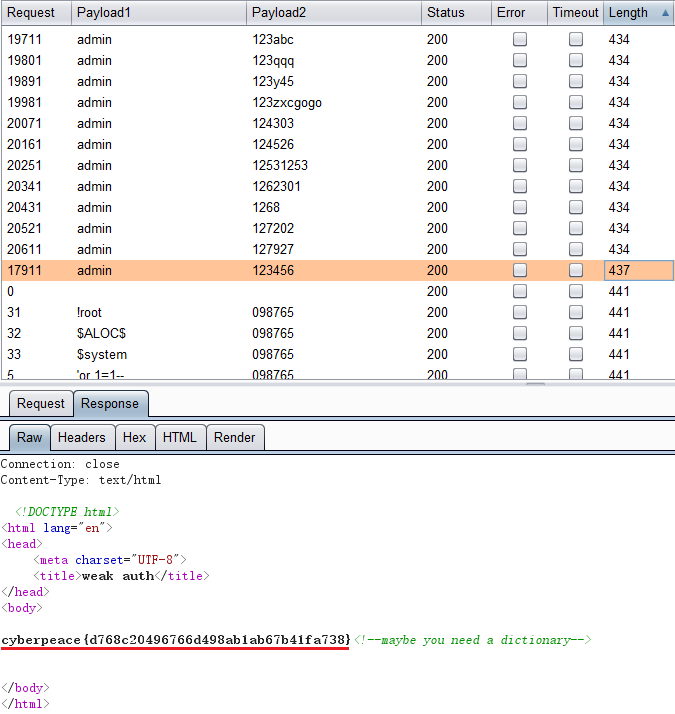
##### 列子2
　　靶机DVWA前面步骤都大同小异，已经知道登录名和密码了，payload就没必要设置那么多了，直接跳到最后查看结果部分
　　可以看到状态码也都一样，length也都一样
　　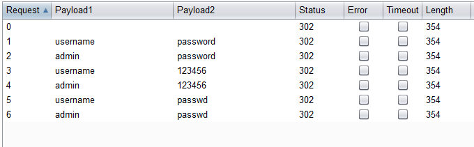
　　直接查看验证正确的响应包
　　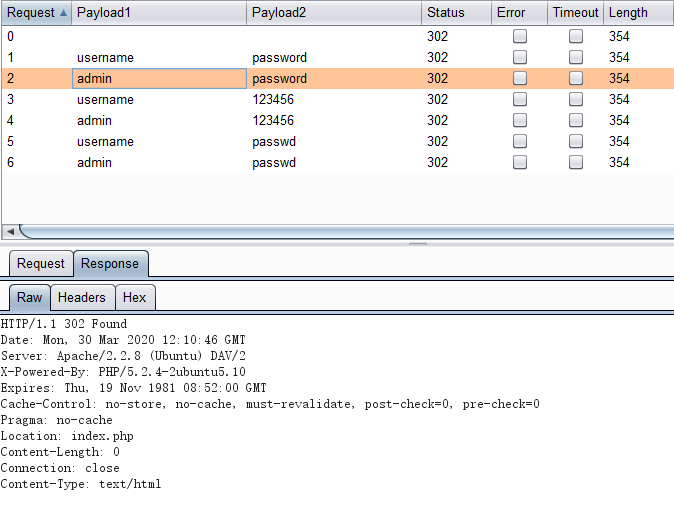
　　查看其他的响应包
　　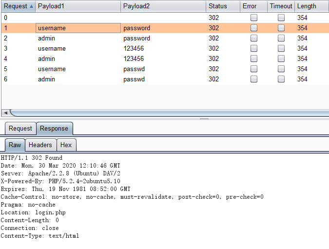
　　仔细查看有一处不一样就是Location，一个是index.php，一个是login.php 这两个刚好都是5个字符，所以筛选出含有index.php的结果，这时候就会将我们想要的结果筛选出来
　　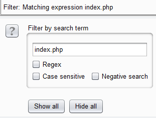
##### Repeater
　　此模块我一般称之为自定义发包器，可以手动发送单个请求包。从而查看响应包中的结果来进入测试
　　老规矩，随便选择一个请求包，右键发送到Repeater
　　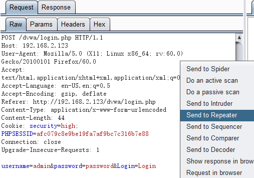
　　来到Repeater模块，具体测试内容可以自己添加或者删除都行
　　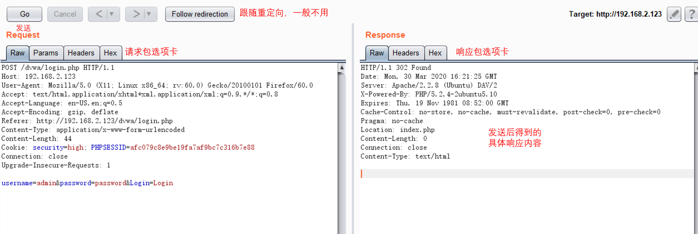
　　右键在请求头中可以看到有很多选择
　　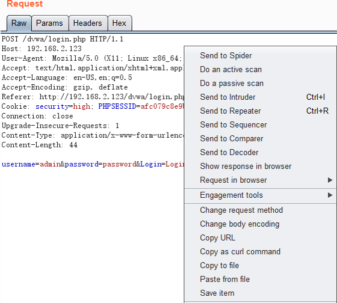
　　选择Change request method(改变请求方式)后，即POST变成GET，GET变成POST，入图所示，当POST变成GET点击GO，响应包的内容明显跟POST请求的响应包不一样
　　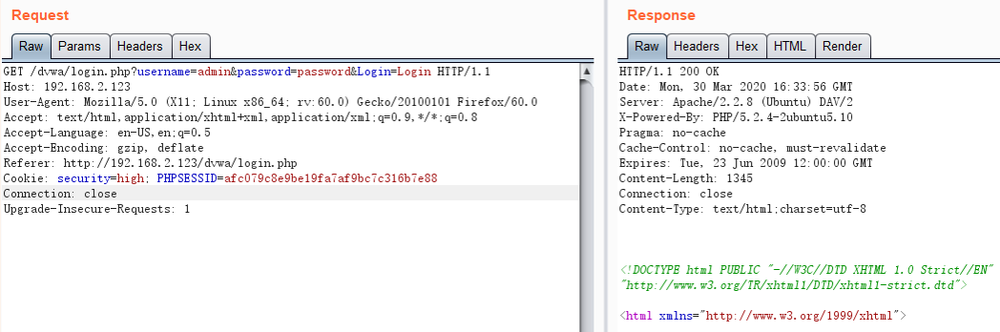
　　选择Change body encoding之前请求包必须是POST方式，GET方式无效
　　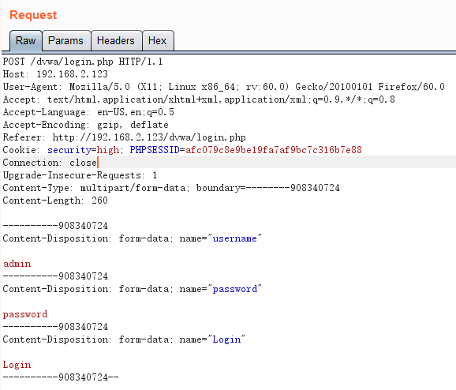
　　当然也可以生成CSRF poc强大到令人发指2333
　　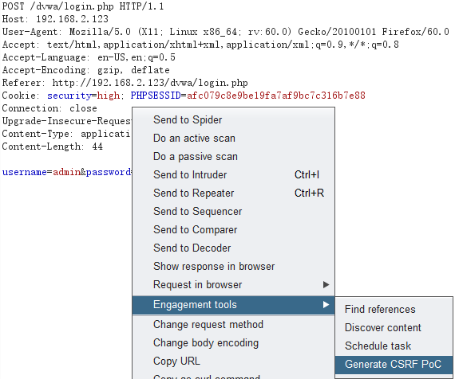
　　选择后新打开CSRF Poc窗口，注意在burp v1.7.32中在浏览器测试我这里已经失效，如果要测试copy html，保存为html文件后，来打开测试
　　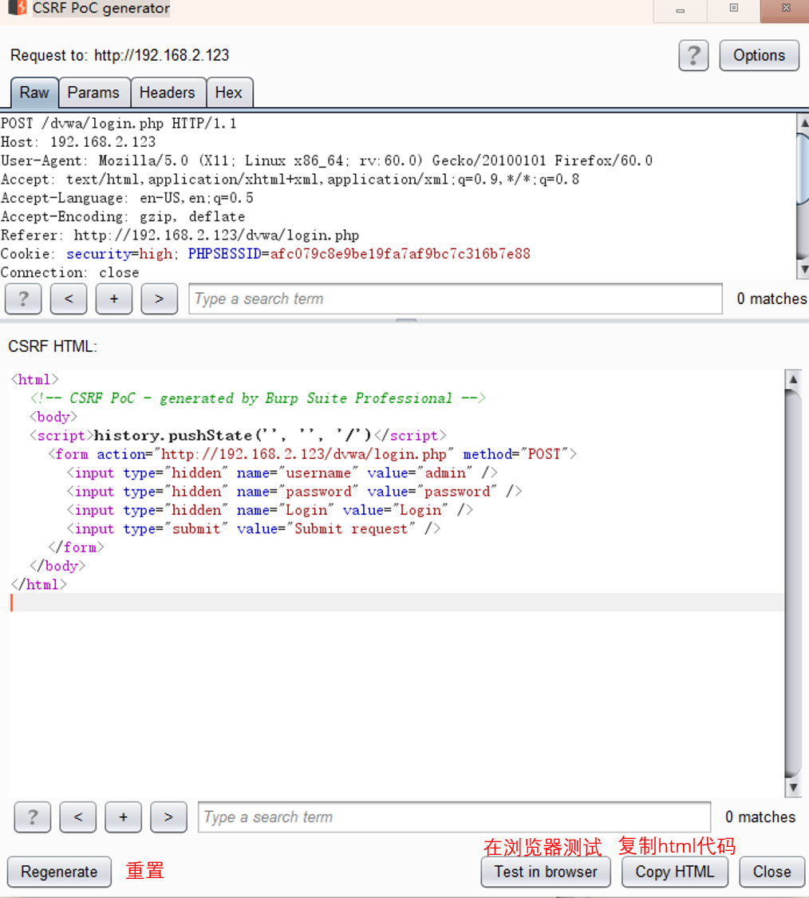
　　选择Copy as curl command，会复制curl命令，在记事本中粘贴下来，在kali的命令行中使用命令
　　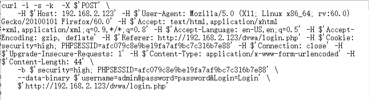
　　curl是一个非常强大的命令，它会向服务器发起http或者ftp等等请求，然后反馈服务器响应
　　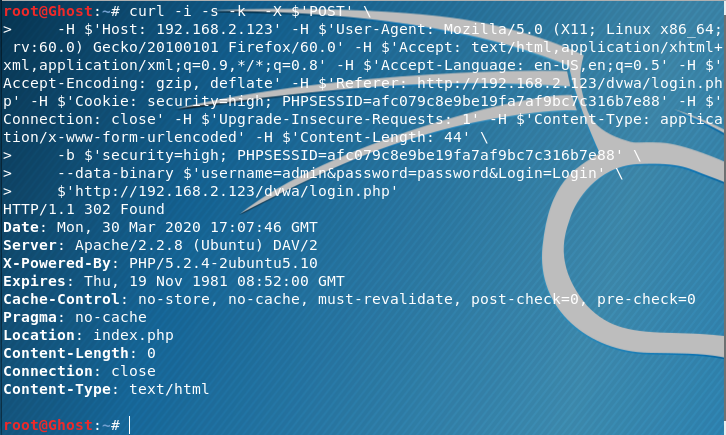
### Sequencer
　　Sequencer(定序器)是一种用于分析数据项的一个样本中的随机性质量的工具。你可以用它来测试应用程序的session tokens(会话tokens)或其他重要数据项的本意是不可预测的，比如反弹CSRF tokens，密码重置tokens等。
　　下面演示如何来测试PHPSESSID的随机性，想详细了解session的作用参考这篇文章[session的作用](https://blog.csdn.net/h19910518/article/details/79348051)
　　而且计算机基本都是采用伪随机数算法，即不会做到一个真正现实世界中的随机，理论上来讲只要测试数据量够大，就能找到一个生成的seesion cookie的循环周期，来预测下一个seesion cookie。所以此模块就是评估生成的随机数质量怎么样

##### 测试DVWA的session
##### 清除cookie
　　我这里是测试dvwa的seeion，所以先到登陆页面将cookie清除掉，选择Delete All后
　　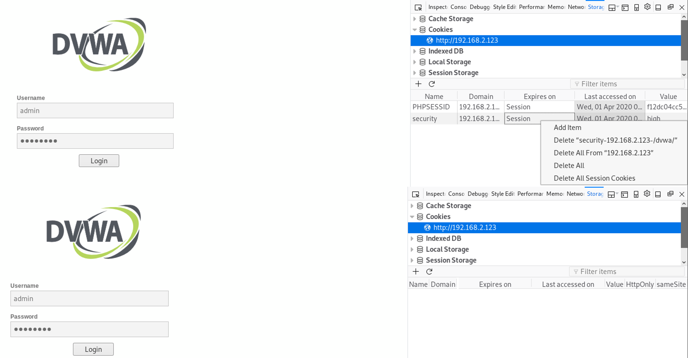
##### 删除站点
　　Target->site map来到站点地图后，选择dvwa站点后右键，delete host，选择yes删除
　　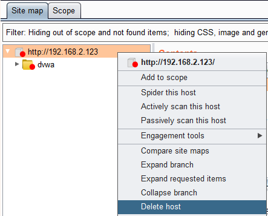
##### 抓取set-cookie请求包
　　清除掉cookie和删除掉站点后，重新进入dvwa的登陆界面，此时burp会重新记录到请求包
　　到Proxy->HTTP history可以看到历史请求，点击filter输入set-cookie，只看设置cookie的<b>响应包</b>过滤完后，找到响应包发送进sequencer
　　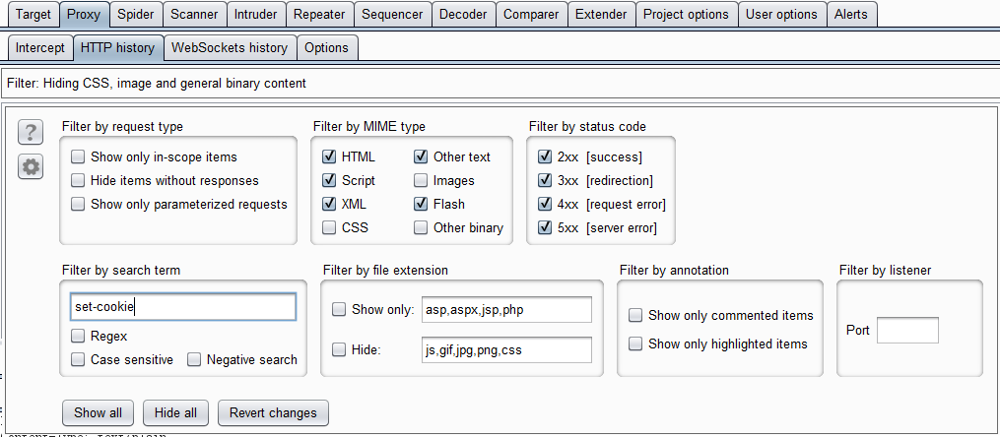
　　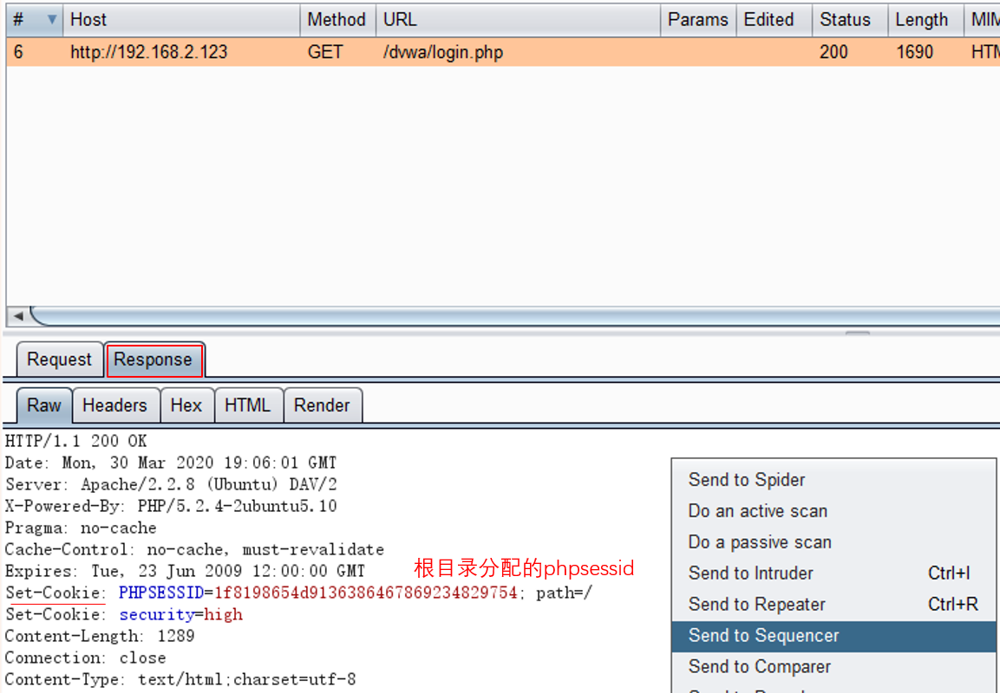
##### 选择测试的cookie
　　burp会自动识别可用的cookie，security是安全级别设置，不是我们要测试的，所以选择PHPSESSID。如果burp没有识别出来，点击手动配置
　　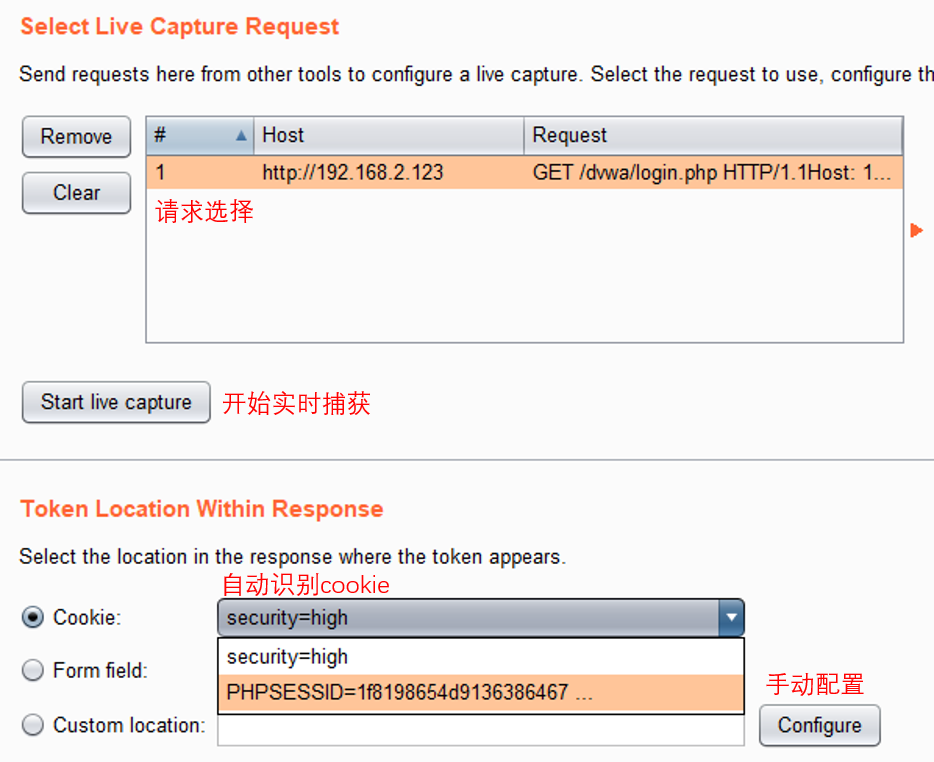
　　手动选择好后，点击ok即可，点击Start live capture(开始实时捕获)开始测试
　　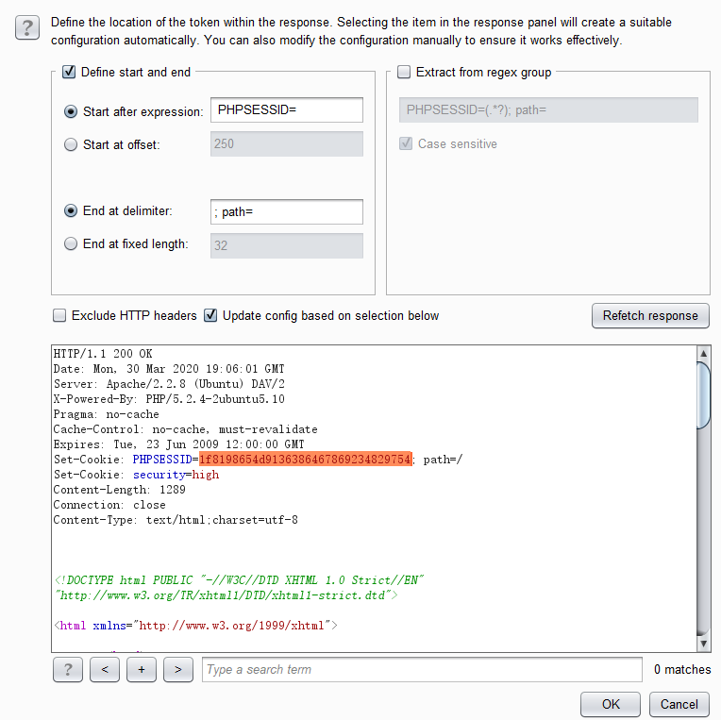
##### 查看分析结果
　　发送的中途你就可以直接点击开始分析，当然数据量越大，得到的结果更准确
　　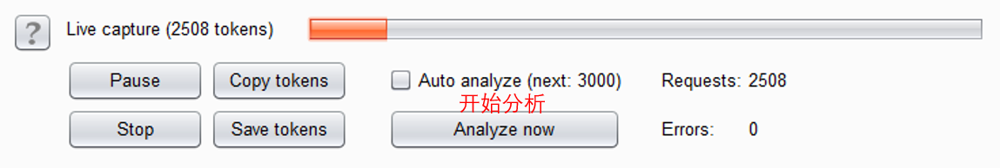
　　可以看到随机性质量结果的是excellent(优秀)
　　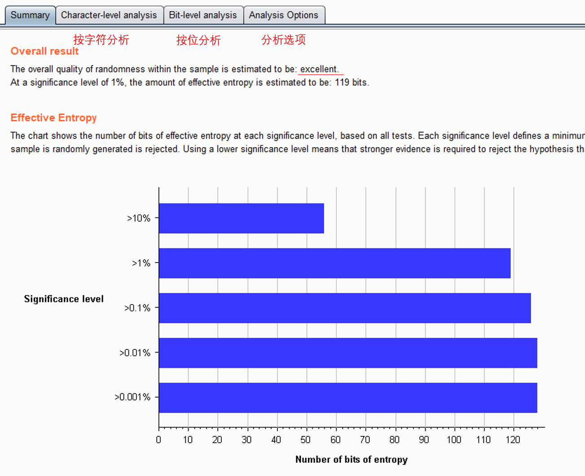
　　[FIPS](https://baike.baidu.com/item/FIPS%20140-2/635016?fr=aladdin)(美国联邦信息处理标准)，其提供了密码模块评测、验证和最终认证的基础，所以只要通过了他们的验证标准，加密安全都是高的。可以看到session的评估质量远远高出及格线
　　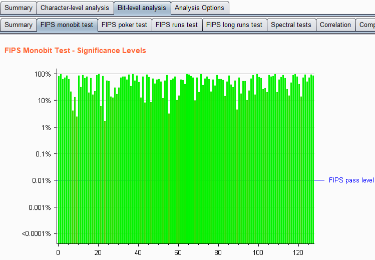

### Decoder
　　用来编码的加密解密，没有什么可以介绍的。直接网上找一个在线加密解密我都感觉比这个强不少
　　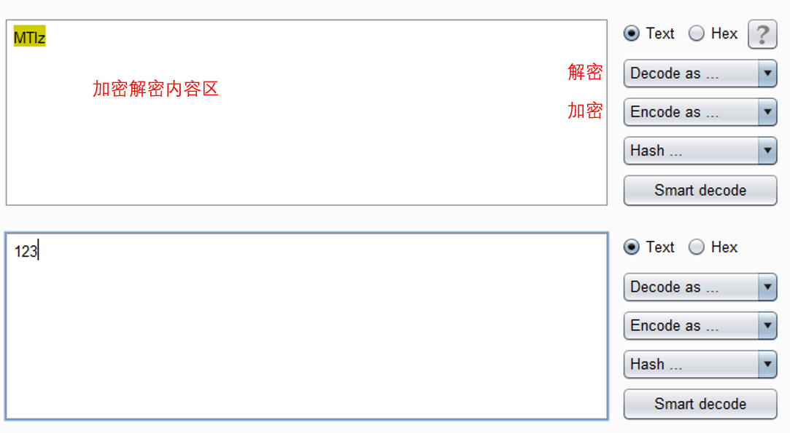

### Comparer
　　比较器，顾名思义比较两次数据之间的区别
　　将dvwa中的登陆请求包发送进Repeater模块后，选择发送后，在响应包中右键send to Comparer，这次是正确的用户名和密码
　　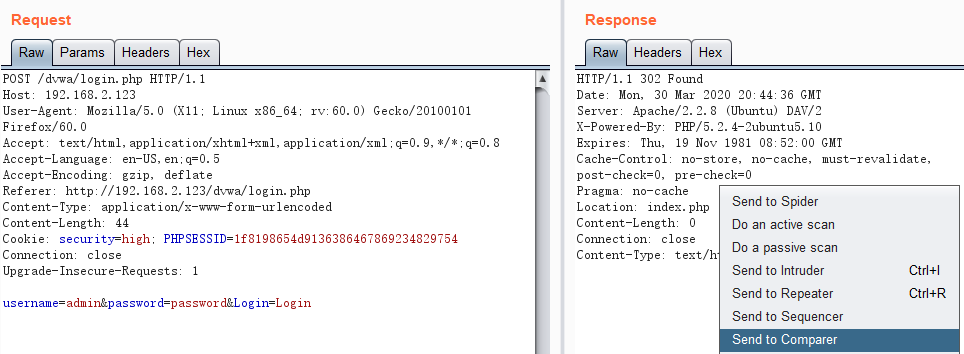
　　这次输入错误的用户名和密码，一样发送到比较器
　　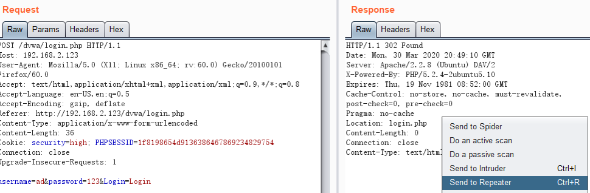
　　它这个是同一个内容分成了多个窗口而已，第一个窗口选择第一个或者第二个，那么第二个窗口必定要选择不同的，不然自己跟自己比较吗？选择按内容比较
　　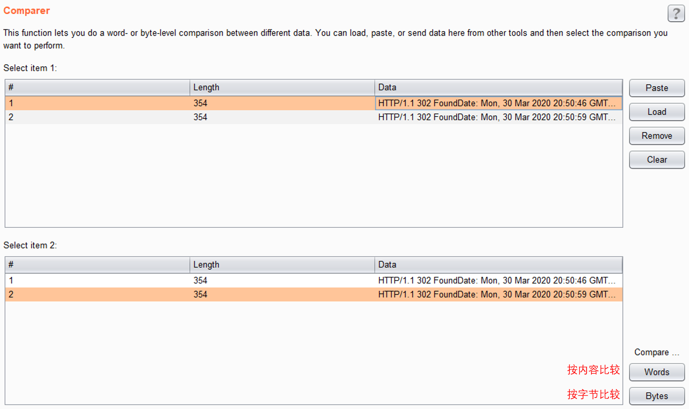
　　下面是比较结果，当然你也可以比较两个项目的不同
　　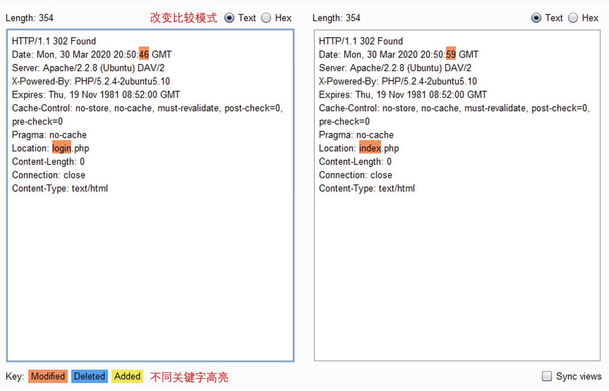
### Alerts
　　　此模块是消息提醒，有一个好处就是看代理服务是否开启
　　　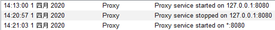
### Extender
　　Burp在软件中提供了支持第三方拓展插件的功能，方便使用者编写自己的自定义插件或从插件商店中安装拓展插件。
　　在BApp Store中，根据受欢迎程度，排名等等筛选出自己喜欢的扩展功能，不多介绍

### 总结
　　burp是一款安全中不可多得的神器，也是从事安全人士必须掌握的一款工具，总之一句话burp牛逼。

Thanks♪(･ω･)ﾉ for reading

