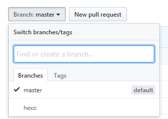
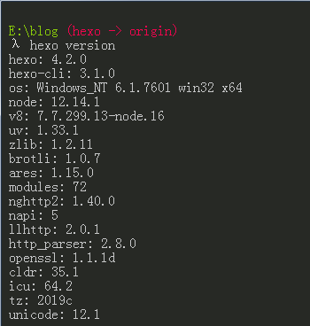
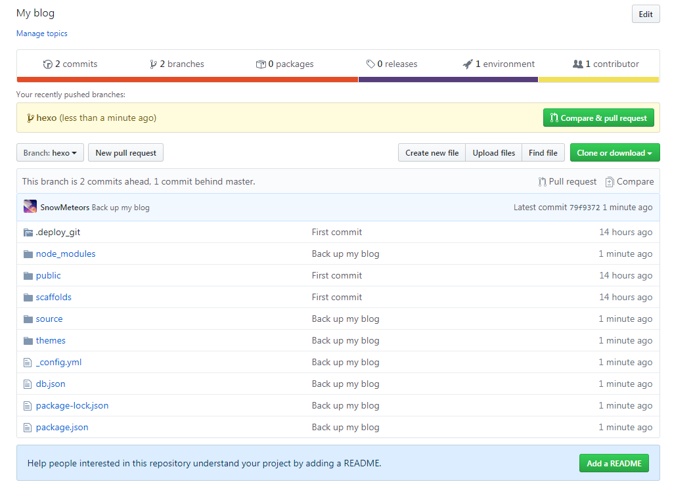

### 前言

强烈建议hexo博客搭建完毕后，并且上传到github后，做的第一件事情是去将你的hexo博客备份到github上去。我知道你肯定很开心搭建博客成功，想怎么怎么去美化你的博客，我想说数据无价，如果你跟笔者有着因为没有备份hexo博客数据，而造成不可逆的后果后，想想都是泪，备份完后再去美化你的博客吧！

<!--more-->

### 建立hexo分支

在博客目录下输入新分支命令(比如我的博客在E:\blog)

```
git checkout -b hexo
```

**hexo**是自定义的分支的名称，建议命名成hexo

### 提交分支到Github

一样在hexo博客的目录下输入以下命令

```
git add .				//注意add后面有一个空格
git commit -m "Backup"
git push origin hexo			//将hexo分支提交到github上去
```

你提交分支可能会失败，这里每个人的情况不一样，根据报错信息,自己解决，我反正搞了很久才提交成功。
提交成功后，你可以看到github上有两个分支如图所示.


### 安装hexo备份插件

输入命令`hexo version`查看Hexo版本



Hexo版本是2.x.x使用以下命令,我的版本可以看到是4.2.0

```
npm install hexo-git-backup@0.0.91 --save
```

Hexo版本是3.x.x使用,我的虽然是4.2.0使用下面命令亲测有效

```bash
npm install hexo-git-backup --save
```

到Hexo博客的根目录`_config.yml`添加以下配置,添加到文件末尾即可

```
backup:
  type: git
  theme: yelee
  message: Back up my blog
  repository:
    github: git@github.com:githubname/githubname.github.io.git,hexo
```

theme:选择备份的主题
message:自定义提交信息
repository:仓库名,分支名，已经建立过hexo分支，所以填hexo，githubname填写成你github上的用户名

### 备份博客数据

最后输入以下命令开始备份博客

```
hexo b
```

备份成功后，你将在你的分支下看到备份好的数据



如果你没有备份成功，那么请使用hexo b后再使用git push origin hexo命令,反正我是没有备份成功后，找了半天教程，才发现这样我才能备份成功，无语了。

以上内容我不能保证你100%成功，那么请善用搜索引擎，成功绝对不是偶然。

<center>♥感谢你的阅读♥</center>