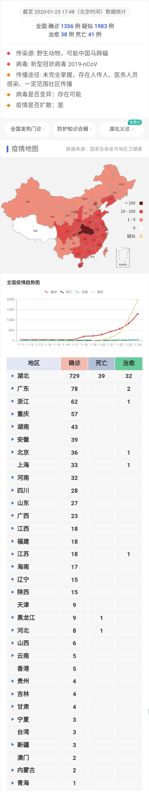
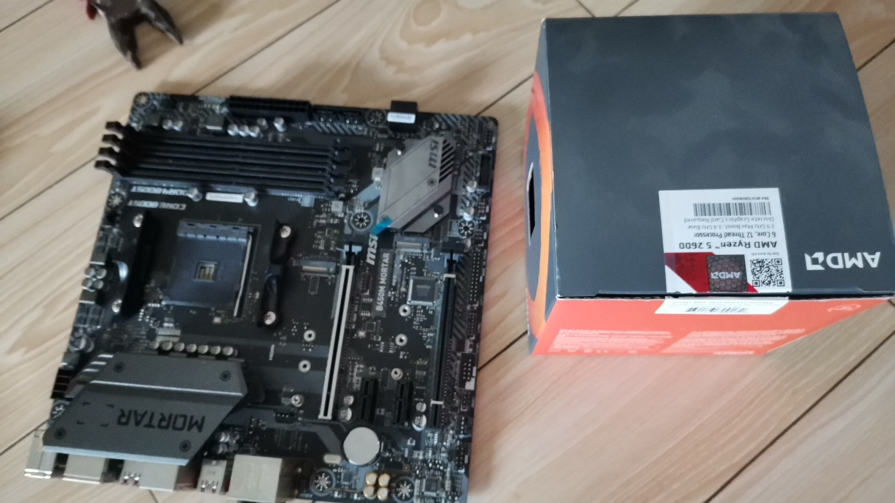

<b>欢迎你查看此篇文章，此篇文章不讲本人，只讲故事，记录生活的点点滴滴，没错被骗进来了吧，O(∩_∩)O哈哈~</b>

## 音乐界面
<link rel="stylesheet" href="/dist/APlayer.min.css">

让音乐陪伴着你我(づ￣3￣)づ╭❤～，慢慢欣赏吧

## 关于此篇
　　本人是一个不怎么写日记的人，换言之也就是没有去记录自己以往的点点滴滴，我从小到大就认认真真写过2次日记，也是我真正想写的东西。然而现在很多事情只有在梦里才有一段完整的回忆，所以我决定此篇文章就记录自己的点点滴滴。今日不谈技术，从新出发，往日不复，不再留恋。当我老了，再也没有当年那么一腔热血的去热爱技术了，打开此篇文章，情景再现，笑着哭着难受着一字不差的看完它，也许这就是我的青春回忆录吧！
## 新的篇章
### 2020-2-5
　　昨天我的cpu和主板寄回来了，对方说是cpu坏了于是乎给我换了一套全新的cpu，好吧虽然我半信半疑，总觉得是主板的问题？。开机通电测试，妈耶还是dram灯报警，我百思不得其解，难道真的是我内存条坏了还是两根？我的fuck？？
　　今天我去了电脑铺直到换了一根内存条后，电脑完美开机运行后，我才意识到还真tm是两根内存条都坏了，这概率我都可以去买彩票了，ε=(´ο｀*)))唉算了返厂换内存条吧。

### 2020-1-24
　　大年三十这天，伴随着外面的烟花声和春晚结束曲《难忘今宵》2019年就这样过去了，2020年它来了。然而，春节最重要的事情是少出门，出门戴口罩，是对自己负责更是对他人负责的一种表现。
　　2020愿望，学会爬虫，学好渗透，弹好《风之诗》就行啦\(^o^)/~，这些都不难吧，对吧上帝!
　　最后祝早日打赢这场战争，祝武汉人民早日渡过难关。

### 2020-1-8
　　已考完试，收拾行李回家。拖着装着台式机的行李箱到了家，台式机打开，插上线，一切检查完毕，开机。(⊙o⊙)…，黑屏了，闻到一股烧焦的味道，马上断电，然后又检查了一遍，再次通电看见主板自检灯卡在了cpu，将cpu拆下重装后、cpu自检过了，又尼玛卡在了dram上虽然这是提示内存有问题，但绝对不可能是我内存的问题，我两条海盗船的内存不可能同时报废，于是单条内存每个通道都试了一遍后，还是黑屏。
　　无果，第二天去了电脑铺，详细说明了情况后，得知在回来的路上因为我不知道cpu松动的情况下，就通电，导致cpu底下的插槽被烧毁。意思就是主板坏了，太棒了我这用了不到半年的主板就这样没了。联系售后等维修结果吧o(╥﹏╥)o，告知年后技术人员才上班，注定这是一个无聊的寒假ε=(´ο｀*)))

## 某段回忆

　
开启时光机，记录下往事

　　前面说过我只写过2次日记，对，它就是关于初中时的有趣事情，一年仅写一篇。然而我急于分享我的日记，带到学校去分享后，大家笑了我也笑了，到了第二天放在我书包里的日记不翼而飞了，就这样我的初中回忆就这样到了不知某人的手里，我失去了只写了两页的本子(可能TA还以为我写了很多吧)和那段完整而有趣的回忆。所以好的东西给真正懂你的人去分享吧，是那么的美好与青涩。(待续----)